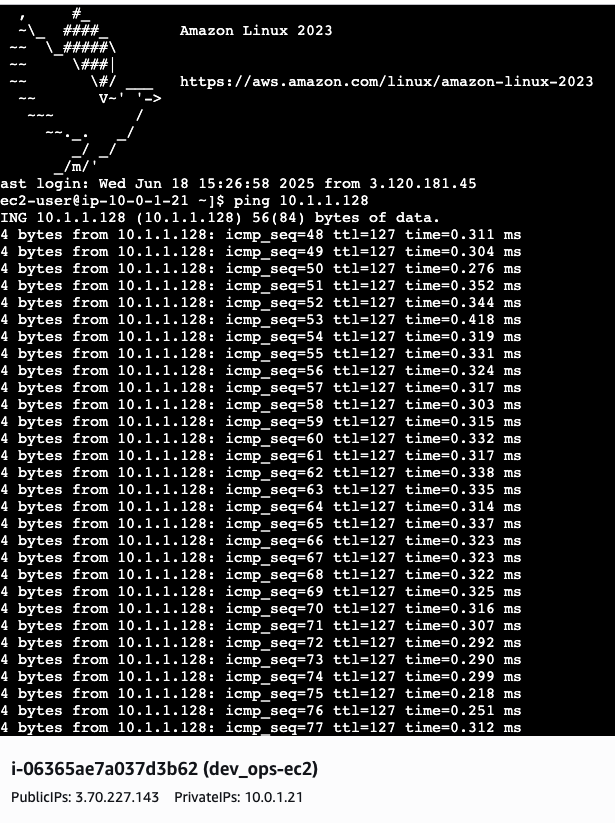
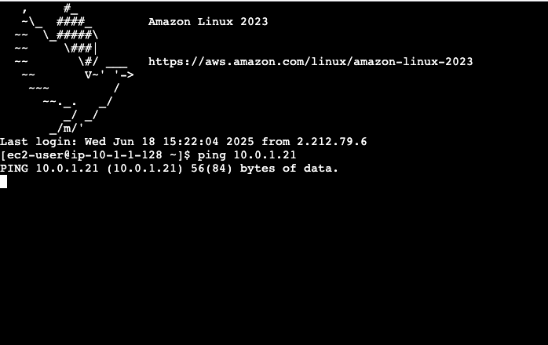

This project demonstrates the ability to design and deploy multiple AWS VPCs, securely connect them using VPC Peering, and configure networking and security to enable private communication between instances across VPC boundaries. The use of Terraform ensures infrastructure as code best practices, making deployments repeatable, manageable, and scalable

This project showcases how to:

- Design isolated yet interconnected environments using VPC Peering
- Automate AWS infrastructure with Terraform
- Manage security groups and route tables for secure cross-VPC communication
---
## 🏗️ How to Deploy
Initialize Terraform
<pre> terraform init </pre>

Review the execution plan
<pre> terraform plan </pre>

Apply the configuration
<pre> terraform apply </pre>

Add the Key Pair and .tfvars to gitignore, and other large terraform files  

###  Clean Up Resources
To avoid ongoing charges, destroy all created resources when done
<pre> terraform destroy </pre>

---

## 🧪 Test Connection

Once your infrastructure is deployed using Terraform, follow these steps to verify that VPC peering and EC2 connectivity are working correctly.

### Test EC2 Access
1. Go to the AWS Console → EC2 → Instances.
2. Locate the EC2 instances deployed in the Dev VPC and Finance VPC.
3. Use EC2 Connect or SSH (with your keypair) to connect to one of the EC2 instances.
4. From the first EC2 instance, try to ping the private IP of the second instance.
    
    Example:
   <pre> ping **private ec2 ip**  </pre>

#### Common Issue: Ping Not Working (100% Packet Loss)

If ping fails and you see:
PING 10.1.1.128 (10.1.1.128) 56(84) bytes of data.
--- 10.1.1.128 ping statistics ---
100% packet loss
This usually means ICMP traffic is being blocked by the Security Group settings.

### Solution: Update Security Group Rules
- Go to AWS Console → EC2 → Security Groups.
- Find the security group attached to each EC2 instance.
Edit Inbound Rules:
- Add a rule:
   Type: All ICMP - IPv4
- Source: The Security Group ID of the other instance's group (this allows internal ping)
- Click Save rules.

Make sure each EC2’s security group allows ICMP traffic from the other EC2’s group.
 After applying these changes, ping should now return responses like:

